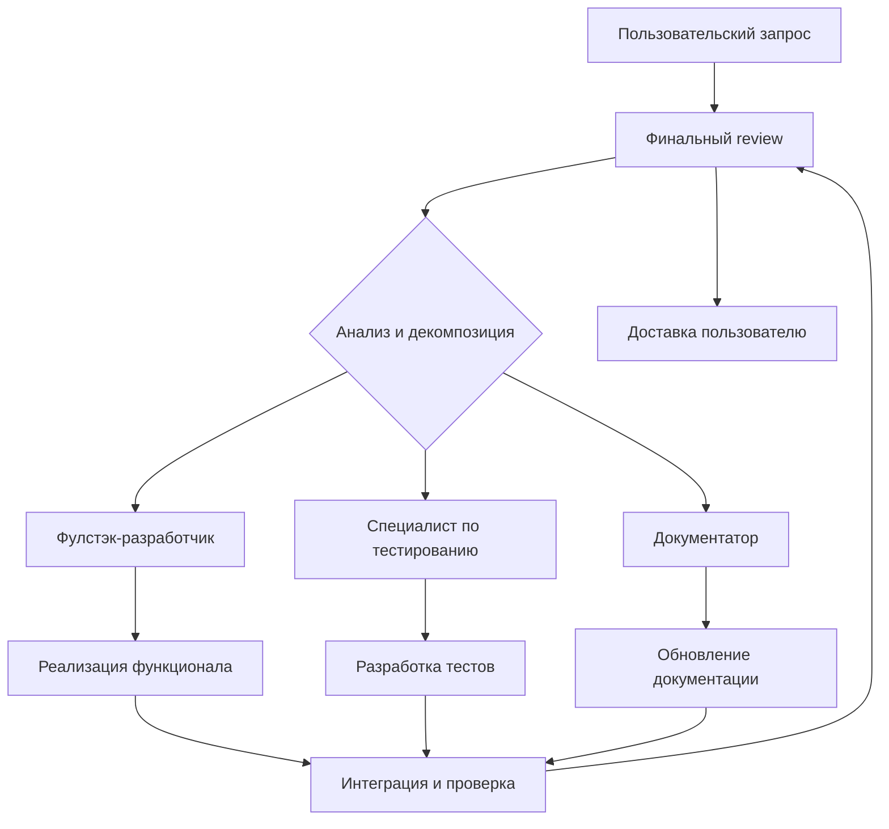

# Руководство по взаимодействию агентов LaraCash

## Архитектура команды



## Командная структура

### 🏗️ Главный разработчик (Lead Developer)
- **Архитектор**: Принимает технические решения
- **Координатор**: Распределяет задачи между агентами
- **Контролер качества**: Проводит финальный review
- **Интегратор**: Объединяет работу всех специалистов

### 👨‍💻 Фулстэк-разработчик (Full-stack Developer)
- **Backend**: Laravel, Eloquent, API, Livewire
- **Frontend**: Blade, Bootstrap, JavaScript
- **База данных**: Миграции, связи, оптимизация
- **Интеграция**: Telegram Mini App, PWA

### 🧪 Специалист по тестированию (Testing Specialist)
- **Тестирование**: Unit, Feature, Integration тесты
- **Качество**: Покрытие кода, performance тесты
- **Автоматизация**: CI/CD, регрессионное тестирование
- **Верификация**: Соответствие требованиям

### 📝 Документатор (Documentation Specialist)
- **API документация**: Эндпоинты, параметры, ответы
- **Пользовательская документация**: Инструкции, руководства
- **Техническая документация**: Архитектура, паттерны
- **Обновление знаний**: Поддержание актуальности документации

## Процесс работы

### Этап 1: Прием и анализ задачи

```bash
# Пример запроса пользователя:
"Добавить функцию поделиться для кешбэков, поддержка Telegram и WeChat, с возможностью выбора периода"
```

### Этап 2: Декомпозиция задачи (Главный разработчик)

```bash
@lead-developer "Анализ запроса на функцию поделиться кешбэками"

# Декомпозиция:
1. Backend API эндпоинт для шаринга
2. Frontend интерфейс выбора параметров
3. Telegram WebApp интеграция
4. WeChat API интеграция
5. Фильтрация по датам и картам
6. Генерация ссылок для шаринга
7. Тестирование всех сценариев
8. Обновление документации
```

### Этап 3: Распределение задач

```bash
# Главный разработчик распределяет:
@fullstack-developer "Реализовать функцию поделиться кешбэками:
- POST /api/cashback/share
- Frontend форма выбора параметров (даты, карты)
- Фильтрация данных для экспорта
- Интеграция с Telegram WebApp API
- Поддержка WeChat API (если возможно)
- Генерация защищенных ссылок"

@testing-specialist "Протестировать функцию поделиться:
- API эндпоинты (/api/cashback/share)
- Валидация параметров (даты, карты)
- Проверка прав доступа (свои кешбэки)
- Функциональность шаринга в Telegram
- Покрытие тестами > 85%
- Performance тесты для больших данных"

@documentation-agent "Обновить документацию:
- API документация (/api/cashback/share)
- Инструкция для пользователей по шарингу
- Обновление CLAUDE.md с новыми эндпоинтами
- Технические детали интеграции"
```

### Этап 4: Параллельная разработка

Агенты работают независимо, сообщая о прогрессе:

```bash
# Пример обновления статуса:
@fullstack-developer "Бэкенд готов:
- POST /api/cashback/share реализован
- Валидация параметров работает
- Фильтрация по датам и картам готова
- Frontend форма создана
- Осталось добавить Telegram integration"

@testing-specialist "Начинаю писать тесты:
- Mock API для тестирования
- Тесты валидации параметров
- Тесты прав доступа
- Интеграционные тесты"
```

### Этап 5: Интеграция и проверка

```bash
# Фулстэк-разработчик сообщает о готовности:
@fullstack-developer "Функция поделиться готова к тестированию:
- API: POST /api/cashback/share
- Frontend: форма с датами и картами
- Интеграции: Telegram WebApp готов
- Документация: параметры и ответы описаны"

# Тестировщик проверяет:
@testing-specialist "Провожу тестирование:
- API работает корректно ✅
- Валидация работает ✅
- Права доступа работают ✅
- Покрытие тестов 92% ✅
- Performance: < 1сек для 1к записей ✅"
```

### Этап 6: Финальный review (Главный разработчик)

```bash
@lead-developer "Провожу финальный review функции поделиться:

✅ Качество кода: Следует Laravel конвенциям
✅ Безопасность: Валидация, права доступа, XSS защита
✅ Производительность: Оптимизированные запросы
✅ Тестирование: 92% покрытие, все сценарии протестированы
✅ Документация: API и пользовательские инструкции обновлены

✅ Ready for production!"
```

## Шаблоны коммуникации

### Задание для фулстэк-разработчика
```bash
@fullstack-developer "Реализовать [название задачи]:

**Backend требования:**
- Laravel контроллер: [название]
- API эндпоинт: [метод] [путь]
- Валидация: [поля и правила]
- Бизнес-логика: [описание]
- Интеграции: [внешние сервисы]

**Frontend требования:**
- Blade шаблон: [название файла]
- Bootstrap компоненты: [элементы]
- JavaScript функциональность: [описание]
- Пользовательский опыт: [требования]

**Требования к качеству:**
- Следование Laravel Conventions
- User-scoped данные
- Обработка ошибок
- Оптимизация запросов

**Срок:** [время]
**Приоритет:** [высокий/средний/низкий]"
```

### Задание для тестировщика
```bash
@testing-specialist "Протестировать [название функционала]:

**Функциональные требования:**
- [описание основной функциональности]
- [граничные случаи]
- [пользовательские сценарии]

**Тестирование безопасности:**
- Права доступа (свои/чужие данные)
- Валидация входных данных
- XSS/CSRF защита
- SQL инъекции

**Тестирование производительности:**
- [критерии производительности]
- [нагрузочные сценарии]
- [максимальные объемы данных]

**Требования к покрытию:**
- Минимальный процент покрытия: [X]%
- Критические пути: [список]
- Интеграционные тесты: [компоненты]

**Срок:** [время]
**Приоритет:** [высокий/средний/низкий]"
```

### Задание для документатора
```bash
@documentation-agent "Обновить документацию для [функционала]:

**API документация:**
- Эндпоинты: [список]
- Параметры запросов: [детали]
- Форматы ответов: [примеры]
- Коды ошибок: [описание]

**Пользовательская документация:**
- Инструкции: [шаги]
- Скриншоты/примеры: [если нужно]
- Возможные проблемы: [решения]
- FAQ: [частые вопросы]

**Техническая документация:**
- Архитектурные изменения: [описание]
- Новые зависимости: [список]
- Конфигурация: [параметры]
- Отладка: [инструкции]

**Файлы для обновления:**
- API.md
- CLAUDE.md
- README.md
- [другие файлы]

**Срок:** [время]
**Приоритет:** [высокий/средний/низкий]"
```

## Управление зависимостями

### Блокировки и решения

```bash
# Пример блокировки:
@fullstack-developer "Столкнулся с проблемой:
Нужно генерировать QR коды для WeChat, но библиотека конфликтует с существующим composer.lock"

# Решение от главного разработчика:
@lead-developer "План решения блокировки:
1. @documentation-agent - исследовать альтернативные библиотеки
2. @fullstack-developer - создать proof of concept с Laravel QR package
3. @testing-specialist - подготовить тесты для QR генерации
4. Принимаем решение сегодня EOD"
```

### Параллельная работа с зависимостями

```bash
# Главный разработчик определяет порядок:
@lead-developer "План реализации функции экспорта в PDF:

Этап 1 (может идти параллельно):
- @fullstack-developer: Backend API для экспорта
- @testing-specialist: Тесты для валидации данных

Этап 2 (после завершения Этапа 1):
- @fullstack-developer: PDF генерация
- @testing-specialist: Тесты PDF генерации

Этап 3 (после Этапа 2):
- @documentation-agent: Обновление документации"

# Отслеживание прогресса:
@fullstack-developer "Этап 1 завершен: API готов ✅"
@testing-specialist "Этап 1 завершен: базовые тесты готовы ✅"
@lead-developer "Начинаем Этап 2: PDF генерацию"
```

## Мониторинг и отчетность

### Ежедневный статус
```bash
@lead-developer "Daily Standup - [дата]:

✅ Завершено вчера:
- @fullstack-developer: Функция экспорта кешбэков
- @testing-specialist: Тесты для экспорта (95% покрытие)
- @documentation-agent: Обновлена API документация

🔄 В работе сегодня:
- @fullstack-developer: Интеграция с Telegram WebApp
- @testing-specialist: Нагрузочные тесты для экспорта
- @documentation-agent: Руководство пользователя

🚧 Блокеры:
- Нет

📋 План на завтра:
- @testing-specialist: Завершить нагрузочные тесты
- @fullstack-developer: Оптимизация производительности экспорта
- @documentation-agent: Финальная проверка документации"
```

### Отчет о завершении задачи
```bash
@lead-developer "Task Completion Report: Функция поделиться кешбэками

📊 Метрики:
- Время разработки: 3 дня
- Покрытие тестами: 92%
- Performance: < 500ms для 1000 записей
- Документация: Полностью обновлена

✅ Критерии успеха выполнены:
- Функционал работает как запланировано
- Все edge cases покрыты тестами
- Безопасность подтверждена
- Документация актуальна

🔄 Обратная связь от пользователей:
- [будет добавлена после внедрения]

📝 Уроки на будущее:
- МыChat интеграция требует дополнительного времени
- Нужны более детальные performance тесты
- Документация нужна параллельно с разработкой"
```

## Разрешение конфликтов

### Технические разногласия
```bash
# Пример конфликта:
@fullstack-developer "Предлагаю использовать Redis для кеширования поиска категорий"
@testing-specialist "Redis усложнит тестирование, лучше использовать файловый кеш"

# Решение от главного разработчика:
@lead-developer "Решение по кешированию:
- Используем Redis (предложение @fullstack-developer)
- @testing-specialist: подготовить тесты с Redis in-memory
- Добавить fallback на файловый кеш
- Задокументировать оба варианта в CLAUDE.md

Причина: Redis лучше для производительности, тестирование решаем через Docker с Redis"
```

### Приоритеты и сроки
```bash
# Конфликт приоритетов:
@fullstack-developer "Нужно добавить новую функцию до конца недели"
@testing-specialist "Текущие тесты требуют времени, не успеем покрыть новую функцию"

# Решение от главного разработчика:
@lead-developer "Приоритеты на неделю:
1. Обязательно: Покрытие существующего функционала тестами (безопасность)
2. Дополнительно: Новая функция (MVP без всех фич)
3. Откладываем: Оптимизация производительности

@fullstack-developer: готовь MVP без оптимизации
@testing-specialist: сфокусируйся на критических тестах безопасности
@documentation-agent: подготовь релиз ноты для MVP"
```

## Инструменты и автоматизация

### GitHub Actions интеграция
```yaml
# .github/workflows/agent-coordination.yml
name: Agent Coordination

on:
  issue_comment:
    types: [created]

jobs:
  agent-task:
    if: contains(github.event.comment.body, '@agent-')
    runs-on: ubuntu-latest
    steps:
      - uses: actions/checkout@v4
      - name: Parse agent assignment
        run: |
          # Логика распознавания заданий агентам
          # Автоматическое создание задач в проекте
```

### Мониторинг прогресса
```bash
# Пример автоматического отчета:
@lead-developer "Automatic Progress Update:

📊 Задачи в работе:
- Feature A: @fullstack-developer (80% complete)
- Feature B: @testing-specialist (60% complete)
- Feature C: @documentation-agent (100% complete)

⏱️ Сроки:
- Feature A: Due tomorrow ⚠️
- Feature B: On track ✅
- Feature C: Completed ✅

🎯 Качество:
- Code coverage: 88%
- Performance tests: All passing
- Documentation: Up to date"
```

## Лучшие практики

### Эффективная коммуникация
1. **Четкие задачи** - всегда с конкретными требованиями и сроками
2. **Регулярные обновления** - ежедневно сообщать о прогрессе
3. **Проактивность** - сообщать о проблемах сразу, не ждать
4. **Конструктивная критика** - фокус на решениях, а не проблемах

### Управление качеством
1. **Параллельное тестирование** - писать тесты вместе с кодом
2. **Регулярные review** - главный разработчик проверяет все изменения
3. **Автоматизация** - CI/CD для автоматической проверки качества
4. **Документация** - обновлять параллельно с разработкой

### Масштабирование команды
1. **Специализация** - каждый агент эксперт в своей области
2. **Стандартизация** - общие паттерны и подходы
3. **Интеграция** - seamless работа между агентами
4. **Обучение** - постоянное улучшение навыков

Эта система взаимодействия обеспечивает эффективную разработку с высоким качеством и четким распределением ответственности между агентами.