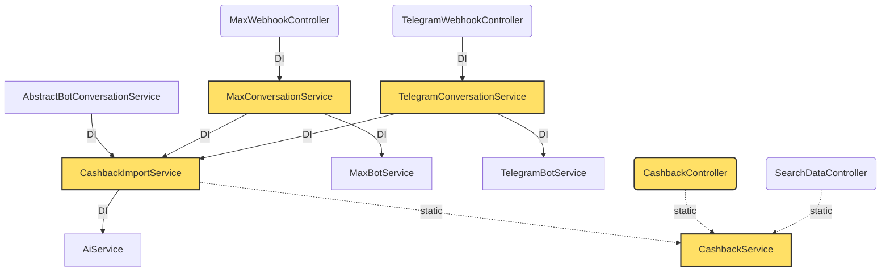

# Dependency Graph & God Nodes
> Auto-generated by `php artisan wiki:generate` — DO NOT edit manually
> Score = indegree*2 + outdegree. Indegree = сколько классов зависят от данного.

## Top 10 God Nodes

| Rank | Class | Type | Indegree | Outdegree | Score |
|------|-------|------|----------|-----------|-------|
| 1 | **CashbackService** | service | 6 | 0 | 12 |
| 2 | **CashbackImportService** | service | 3 | 2 | 8 |
| 3 | **MaxConversationService** | service | 1 | 2 | 4 |
| 4 | **TelegramConversationService** | service | 1 | 2 | 4 |
| 5 | **CashbackController** | controller | 0 | 4 | 4 |
| 6 | **AiService** | service | 1 | 0 | 2 |
| 7 | **FileStorageService** | service | 1 | 0 | 2 |
| 8 | **MaxBotService** | service | 1 | 0 | 2 |
| 9 | **TelegramBotService** | service | 1 | 0 | 2 |
| 10 | **AbstractBotConversationService** | service | 0 | 1 | 1 |

## Dependency Graph (Top 5 God Nodes + их соседи)

## Graph Statistics

- **Total Nodes:** 34
- **Total Edges:** 15
- **DI Edges:** 9 (constructor dependencies)
- **Static Call Edges:** 6 (Service::method calls)
- **Avg Edges per Node:** 0.44
